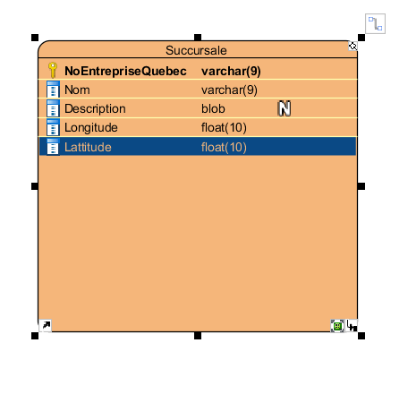
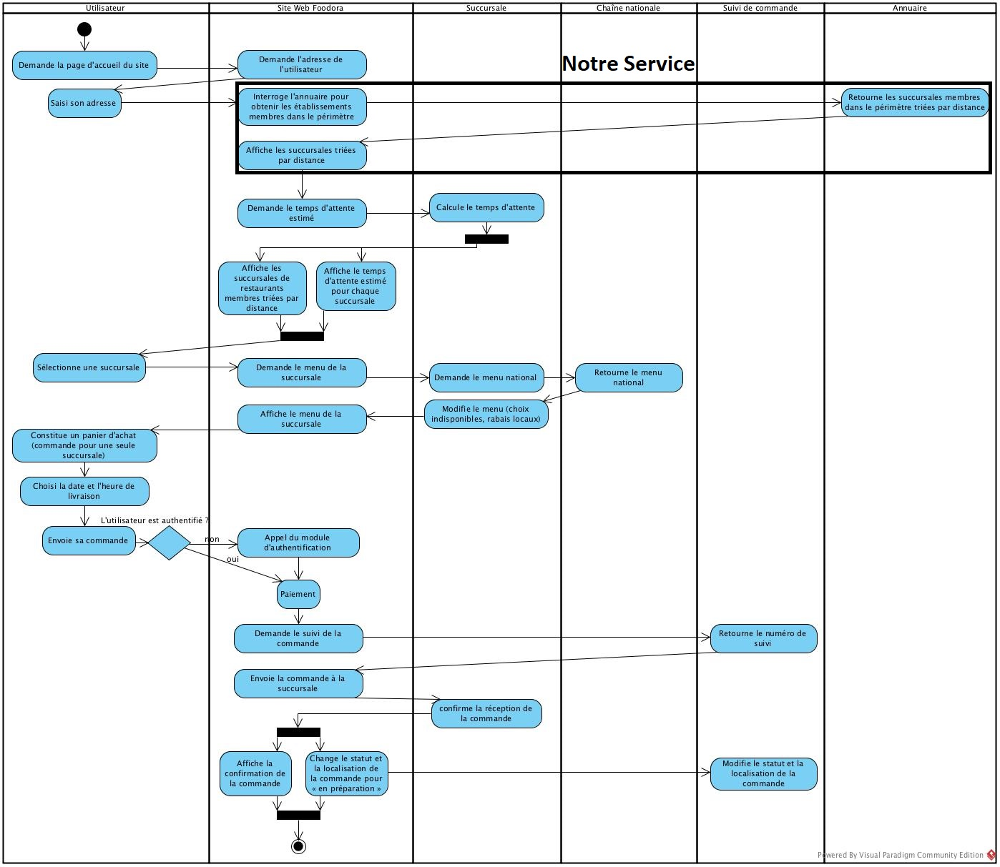

# Service d'annuaire des succursales membres pour le projet en développement web
Le service doit s'occupper de fournir une liste de succursales contenue dans une distance à partir d'un point.

Notre endpoint sera `service-annuaire/succursales` avec en paramètres `distance`, `longitude` et `latitude` qui sont tous des float.

Diagramme de Base de Donnée  

Diagramme de séquence  

