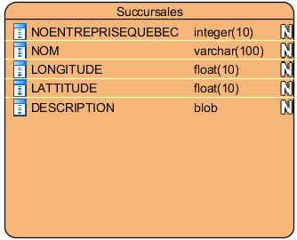

# Service d'annuaire des succursales membres pour le projet en développement web
Le service doit s'occupper de fournir une liste de succursales contenue dans une distance à partir d'un point.

Endpoints disponibles:

`@GET /api/succursales`  
Obtenir la liste complète des succursales

`@GET /api/succursales`  
Paramètres:  
`distance`: La distance en mètres à partir de laquelle chercher toutes succursale à proximité  
`longitude`: Longitude du du point de recherche  
`latitude`: Latitude du point de recherche  
Obtenir la liste complète des succursales

`@GET /api/succursales/{id}`  
Obtenir une succursale à partir de son numéro d'entreprise du Québec  

`@PUT /api/succursales`  
Corps:  
```csharp
{
	"description": string,
	"noEntrepriseQuebec": int,
	"lattitude": float,
	"longitude": float,
	"nom": string
}
```
Créer ou modifier une succursale

`@DELETE /api/succursales/{id}`  
Supprimer une succursale à partir de son numéro d'entreprise du Québec

Diagramme de Base de Donnée  


Diagramme de séquence  


Ceci est un projet Maven / Springboot. Toute librairie devrait être déjà inclut. La bonne BD doit être indiquée dans [application.properties](src\main\resources\application.properties) et dans [Connexion.java](src\main\java\com\succursaleAnnuaire\succursaleAnnuaire\models\Connexion.java) où le projet ne démarrera pas.
